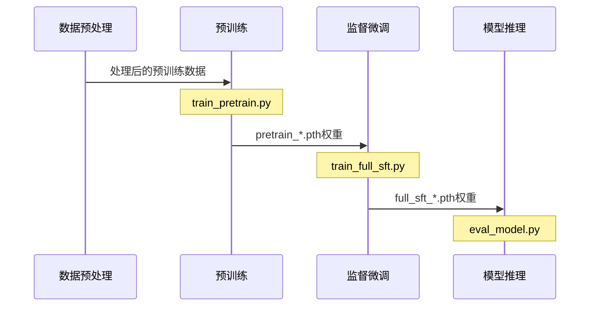
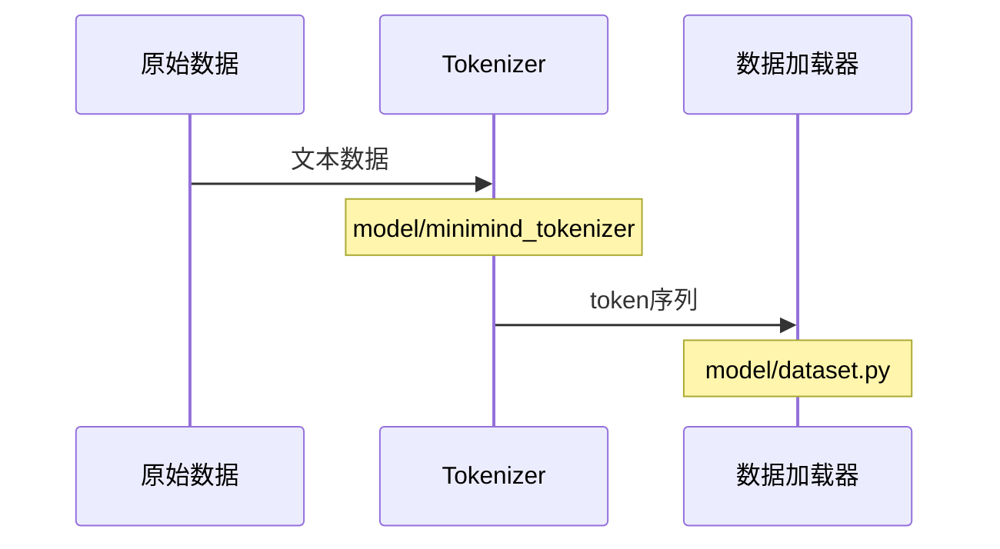
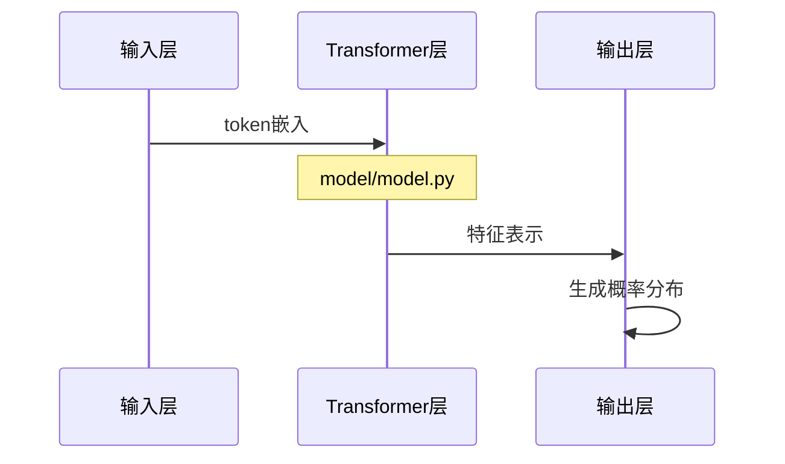
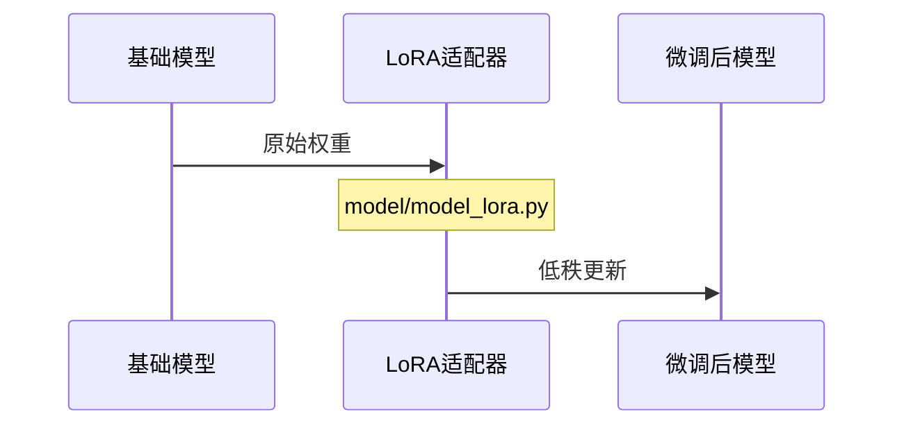
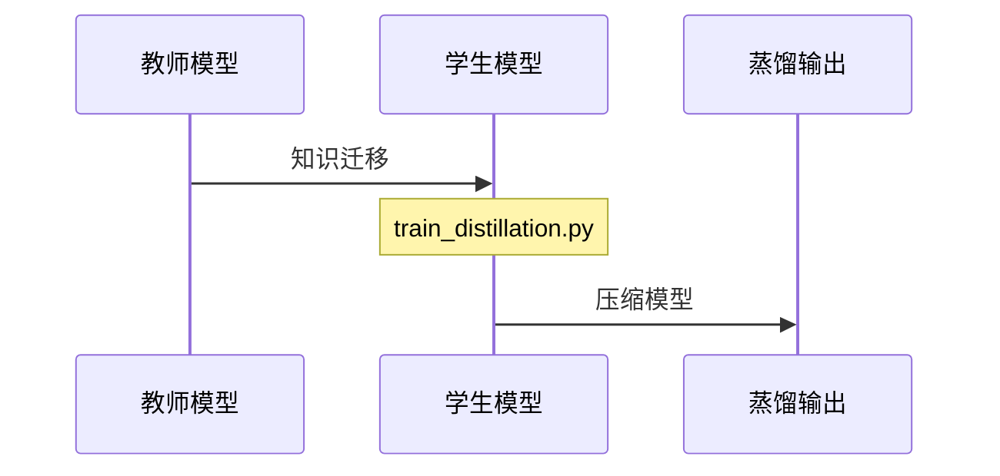
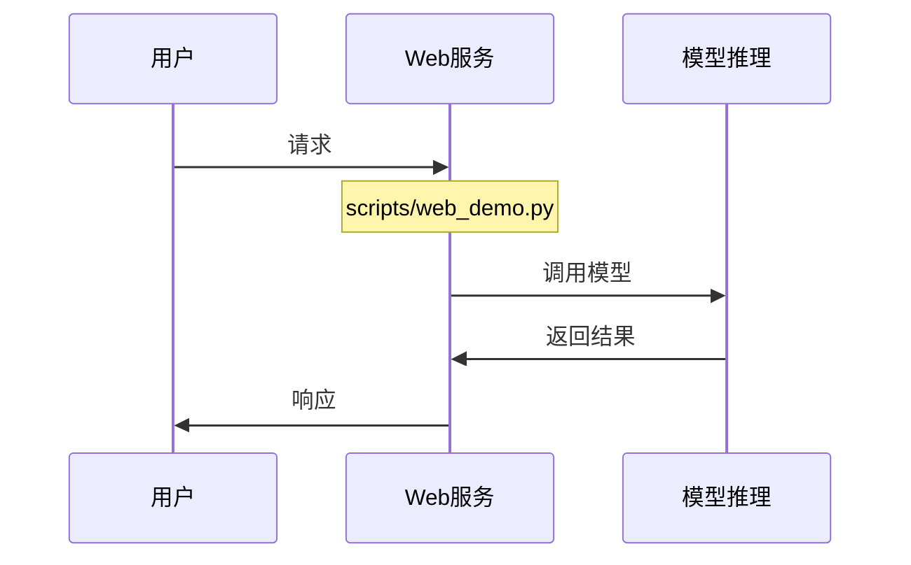

# MiniMind 项目技术文档

## 项目概述

MiniMind 是一个轻量级的语言模型项目，旨在用最小的资源实现基础的语言理解和生成能力。本文档将详细说明项目的运行原理和技术架构。

## 系统架构

## 核心组件说明

### 1. 数据处理流程

### 2. 模型架构

## 训练流程详解

### 1. 预训练阶段

- 入口文件：`train_pretrain.py`
- 目标：学习基础的语言知识和模式
- 输出：`pretrain_*.pth`权重文件

### 2. 监督微调阶段

- 入口文件：`train_full_sft.py`
- 目标：优化模型的对话能力
- 输出：`full_sft_*.pth`权重文件

### 3. 推理部署

- 入口文件：`eval_model.py`
- 功能：加载训练好的模型进行推理
- 支持：命令行交互和API服务

## 扩展功能

### LoRA微调

### 知识蒸馏

## 关键技术要点

1. **模型配置**
   - 在`model/LMConfig.py`中定义
   - 支持灵活调整模型大小和训练参数

2. **数据处理**
   - 使用自定义tokenizer
   - 支持动态批处理和数据增强

3. **训练优化**
   - 支持混合精度训练
   - 实现梯度累积和学习率调度

## 部署和服务

## 性能优化建议

1. **数据预处理优化**
   - 使用多进程加载数据
   - 实现数据缓存机制

2. **训练加速**
   - 使用梯度检查点
   - 优化批处理大小

3. **推理优化**
   - 模型量化
   - 批处理推理

## 总结

MiniMind项目通过精心设计的架构和优化策略，实现了一个轻量级但功能完整的语言模型系统。从数据处理到模型训练，再到推理部署，每个环节都经过精心设计和优化，确保了系统的高效性和可扩展性。