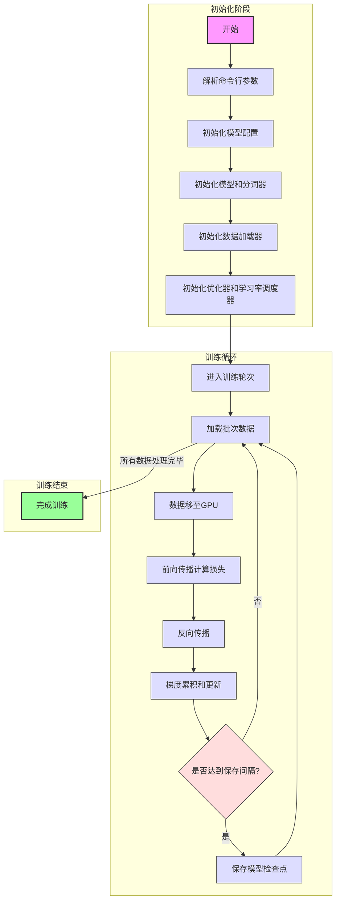

# 预训练代码工作流程图



## 关键步骤说明

1. **初始化阶段**
   - 解析命令行参数：设置训练参数如批次大小、学习率等
   - 初始化模型配置：设置模型维度、层数等超参数
   - 初始化模型和分词器：创建模型实例和加载分词器
   - 初始化数据加载器：准备训练数据

2. **训练循环**
   - 加载批次数据：从数据集中获取训练样本
   - 数据处理：将数据移至GPU并进行必要的预处理
   - 模型训练：进行前向传播和反向传播
   - 参数更新：根据累积的梯度更新模型参数
   - 模型保存：定期保存训练检查点

3. **训练结束**
   - 完成所有训练轮次后结束训练

## 特殊说明

- 使用梯度累积技术来支持更大的批次大小
- 支持分布式训练加速
- 使用混合精度训练提高效率
- 动态调整学习率优化训练过程

## 重要概念说明

### 1. 分词器 (Tokenizer)
分词器是将原始文本转换为模型可处理的数值序列的工具。在MiniMind中：
- **工作原理**：将文本分割成标记(tokens)，并映射为数字ID
- **实现方式**：使用`AutoTokenizer`加载自定义分词器
- **处理流程**：
  ```
  文本 → 分词 → 数字ID → 张量 → 模型输入
  ```
- **关键特性**：
  - 添加特殊标记(`<s>`, `</s>`)
  - 处理长度限制(截断和填充)
  - 创建注意力掩码和损失掩码

### 2. 前向传播 (Forward Propagation)
前向传播是模型生成预测的过程，在语言模型中：
- **计算流程**：
  1. 输入序列通过嵌入层转换为向量表示
  2. 经过多层Transformer结构处理信息
  3. 每个Transformer层包含自注意力和前馈网络
  4. 输出层生成每个位置上词表中所有标记的概率分布
- **代码实现**：
  ```python
  with ctx:  # 混合精度上下文
      res = model(X)  # 前向传播
      # 计算损失
      loss = loss_fct(res.logits.view(-1, res.logits.size(-1)), Y.view(-1))
  ```
- **关键技术**：旋转位置编码(RoPE)实现位置感知

### 3. 反向传播 (Backward Propagation)
反向传播是计算梯度并更新模型参数的过程：
- **计算流程**：
  1. 计算损失函数对模型输出的梯度
  2. 沿网络反向传播梯度，计算每个参数的梯度
  3. 使用优化器根据梯度更新参数
- **代码实现**：
  ```python
  # 缩放损失并反向传播
  scaler.scale(loss).backward()
  
  # 根据累积步骤更新参数
  if (step + 1) % args.accumulation_steps == 0:
      scaler.unscale_(optimizer)  # 反缩放梯度
      torch.nn.utils.clip_grad_norm_(model.parameters(), args.grad_clip)  # 梯度裁剪
      scaler.step(optimizer)  # 更新参数
      scaler.update()  # 更新缩放因子
      optimizer.zero_grad(set_to_none=True)  # 清零梯度
  ```

### 4. 梯度累积 (Gradient Accumulation)
梯度累积允许在有限显存下模拟大批量训练：
- **工作原理**：
  1. 将大批量分成多个小批量
  2. 对每个小批量执行前向和反向传播，但不立即更新参数
  3. 累积多个小批量的梯度
  4. 达到指定步数后，一次性更新参数
- **实现方法**：
  ```python
  # 将损失除以累积步数
  loss = loss / args.accumulation_steps
  
  # 累积梯度
  scaler.scale(loss).backward()
  
  # 当达到累积步数时更新参数
  if (step + 1) % args.accumulation_steps == 0:
      # 更新参数逻辑
  ```
- **优势**：允许在有限GPU内存下训练更大的模型或使用更大的批量

### 5. 混合精度训练 (Mixed Precision Training)
混合精度训练结合FP16和FP32精度，提高训练效率：
- **工作原理**：
  1. 在前向传播和梯度计算中使用FP16（半精度）
  2. 使用FP32（全精度）存储权重和执行最终更新
  3. 使用梯度缩放防止FP16下溢
- **实现方法**：
  ```python
  # 初始化缩放器
  scaler = torch.cuda.amp.GradScaler(enabled=(args.dtype in ['float16', 'bfloat16']))
  
  # 混合精度上下文
  ctx = torch.cuda.amp.autocast()
  
  # 缩放损失和梯度
  scaler.scale(loss).backward()
  
  # 反缩放、更新和缩放因子调整
  scaler.unscale_(optimizer)
  scaler.step(optimizer)
  scaler.update()
  ```
- **优势**：最多可减少一半的显存使用，同时加速训练

### 6. 分布式训练 (Distributed Training)
分布式训练利用多GPU并行计算加速训练：
- **工作原理**：
  1. 在多个设备上并行处理数据
  2. 梯度同步确保模型一致性
  3. 使用环境变量配置进程通信
- **实现方法**：
  ```python
  # 初始化进程组
  dist.init_process_group(backend="nccl")
  
  # 封装模型
  model = DistributedDataParallel(model, device_ids=[ddp_local_rank])
  
  # 使用分布式采样器
  train_sampler = DistributedSampler(train_ds)
  ```
- **关键组件**：`DistributedDataParallel`(模型并行)和`DistributedSampler`(数据分割)