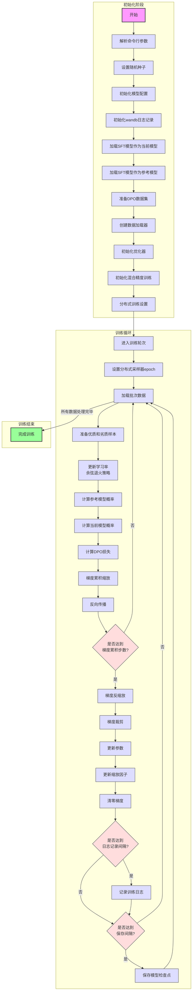

# 直接偏好优化(DPO)工作流程详解

## 什么是直接偏好优化(DPO)?

直接偏好优化(Direct Preference Optimization，简称DPO)是一种让语言模型学会"按人类喜好回答"的训练方法。想象一下：
- **监督微调(SFT)模型**就像一个已经学会基本礼仪的学生
- **DPO训练**就是通过"这个回答好，那个回答不好"的对比，进一步提升学生的表现
- 通过大量的"优质回答-劣质回答"对比，模型学会了更好地符合人类偏好

## 工作流程图



## 详细步骤说明

### 1. 初始化阶段

#### 解析命令行参数
就像准备一次旅行，我们需要决定带什么东西。在DPO训练中，我们设置：
- **批次大小**：一次处理多少数据对
- **学习率**：模型学习的速度（DPO通常需要很小的学习率）
- **训练轮数**：重复学习数据的次数
- **温度参数beta**：控制优化强度的参数

```python
parser = argparse.ArgumentParser(description="MiniMind RLHF")
parser.add_argument("--batch_size", type=int, default=2)
parser.add_argument("--learning_rate", type=float, default=1e-8)  # 注意DPO的学习率通常很小
parser.add_argument("--epochs", type=int, default=2)
# 更多参数...
args = parser.parse_args()
```

#### 初始化模型配置
设置模型的"大脑结构"：
- **维度(dim)**：模型的思考能力有多强
- **层数(n_layers)**：模型思考的深度
- **最大序列长度**：模型一次能处理多长的文本

```python
lm_config = LMConfig(dim=args.dim, n_layers=args.n_layers, max_seq_len=args.max_seq_len, use_moe=args.use_moe)
```

#### 加载模型和参考模型
DPO需要两个模型：
- **当前模型**：我们要训练的模型，初始为SFT模型
- **参考模型**：固定不变的SFT模型，用于计算概率比

```python
# 加载分词器
tokenizer = AutoTokenizer.from_pretrained('./model/minimind_tokenizer')

# 初始化当前模型
model = MiniMindLM(lm_config)
moe_path = '_moe' if lm_config.use_moe else ''
ckp = f'./out/full_sft_{lm_config.dim}{moe_path}.pth'
state_dict = torch.load(ckp, map_location=args.device)
model.load_state_dict(state_dict, strict=False)

# 初始化参考模型（使用相同的权重）
ref_model = MiniMindLM(lm_config)
ref_model.load_state_dict(state_dict, strict=False)
# 参考模型不需要训练
ref_model.eval()
ref_model.requires_grad_(False)
```

#### 准备DPO数据集
准备"优质回答-劣质回答"对的教学材料：
- 加载包含人类偏好对比的数据集
- 每个样本包含相同问题的两个不同回答，一个被人类标记为更好

```python
train_ds = DPODataset(args.data_path, tokenizer, max_length=lm_config.max_seq_len)
```

#### 初始化优化器
选择一种教学方法，决定如何调整模型的"思维方式"：
- 使用AdamW优化器，它能智能地调整学习速度
- 设置非常小的学习率，避免破坏已有的SFT能力

```python
optimizer = optim.AdamW(model.parameters(), lr=args.learning_rate)
```

#### 初始化混合精度训练
使用聪明的学习技巧，让训练更快：
- 混合使用不同精度的数字计算
- 创建梯度缩放器，防止精度问题

```python
scaler = torch.cuda.amp.GradScaler(enabled=(args.dtype in ['float16', 'bfloat16']))
ctx = nullcontext() if device_type == "cpu" else torch.cuda.amp.autocast()
```

### 2. 训练循环

#### 进入训练轮次
开始一轮又一轮的学习过程：
- 每个epoch会学习整个数据集一次
- 对于分布式训练，确保数据正确分配

```python
for epoch in range(args.epochs):
    if args.distributed:
        train_sampler.set_epoch(epoch)  # 确保每个epoch数据分布不同
```

#### 加载批次数据和准备样本
取一小批数据进行学习，并准备优质和劣质样本：
- 每个批次包含多个"优质-劣质"回答对
- 将它们拼接成一个大批次进行处理

```python
for step, batch in enumerate(train_loader):
    # 将数据移至GPU并准备preferred和rejected样本
    x_chosen = batch['x_chosen'].to(args.device)
    x_rejected = batch['x_rejected'].to(args.device)
    y_chosen = batch['y_chosen'].to(args.device)
    y_rejected = batch['y_rejected'].to(args.device)
    mask_chosen = batch['mask_chosen'].to(args.device)
    mask_rejected = batch['mask_rejected'].to(args.device)
    
    # 将preferred和rejected样本拼接成一个batch
    x = torch.cat([x_chosen, x_rejected], dim=0)
    y = torch.cat([y_chosen, y_rejected], dim=0)
    mask = torch.cat([mask_chosen, mask_rejected], dim=0)
```

#### 更新学习率
使用余弦退火策略调整学习速度：
- 开始时学习率较高，模型学习快
- 随着训练进行，学习率逐渐降低，模型学习更精细

```python
lr = get_lr(epoch * iter_per_epoch + step, args.epochs * iter_per_epoch, args.learning_rate)
for param_group in optimizer.param_groups:
    param_group['lr'] = lr
```

#### 计算参考模型和当前模型的概率
计算两个模型对优质和劣质回答的概率：
- 参考模型的概率用于计算基准概率比
- 当前模型的概率用于优化，使其更偏好优质回答

```python
with ctx:
    # 计算参考模型的输出（不需要梯度）
    with torch.no_grad():
        ref_outputs = ref_model(x)
        ref_logits = ref_outputs.logits
    # 获取参考模型的token概率并应用mask
    ref_probs = logits_to_probs(ref_logits, y)
    ref_probs = ref_probs * mask
    
    # 计算当前模型的输出
    outputs = model(x)
    logits = outputs.logits
    probs = logits_to_probs(logits, y)
    probs = probs * mask
```

#### 计算DPO损失
使用特殊的DPO损失函数，让模型学会偏好优质回答：
- 计算当前模型和参考模型的概率比
- 使用这个比值来优化模型，增加对优质回答的偏好

```python
# 计算DPO损失
loss = dpo_loss(ref_probs, probs, beta=0.1)
# 如果使用梯度累积，对损失进行缩放
loss = loss / args.accumulation_steps
```

#### 反向传播和参数更新
根据损失调整模型的"思维方式"：
- 反向传播计算如何调整模型参数
- 达到累积步数后更新模型参数

```python
# 反向传播
scaler.scale(loss).backward()

# 梯度累积达到指定步数后更新参数
if (step + 1) % args.accumulation_steps == 0:
    scaler.unscale_(optimizer)
    # 梯度裁剪，防止梯度爆炸
    torch.nn.utils.clip_grad_norm_(model.parameters(), args.grad_clip)
    scaler.step(optimizer)
    scaler.update()
    optimizer.zero_grad(set_to_none=True)
```

#### 记录训练日志和保存模型
记录学习进度并定期保存成果：
- 定期打印和记录训练损失和学习率
- 定期保存模型检查点，以便随时恢复训练

```python
# 定期打印训练日志
if step % args.log_interval == 0:
    # 打印日志...

# 定期保存模型检查点
if (step + 1) % args.save_interval == 0 and (not ddp or dist.get_rank() == 0):
    # 保存模型...
```

## 重要概念说明

### 1. 直接偏好优化(DPO)
**简单解释**：教会模型"这个回答比那个回答更好"。

想象你在教一个已经会回答问题的学生如何回答得更好：
- **SFT模型**：这个学生已经学会了如何回答问题
- **DPO数据**：你准备了一系列"好回答-坏回答"的对比例子
- **DPO过程**：反复向学生展示这些例子，让他学会区分好坏回答
- **结果**：学生学会了在多种可能的回答中选择更符合人类偏好的那个

在代码中，DPO数据集包含了人类标注的偏好对比，模型通过学习这些例子，逐渐调整自己的参数，使输出更符合人类偏好。

### 2. 参考模型(Reference Model)
**简单解释**：一个"老师"模型，用来计算基准概率。

想象你在改进自己的写作风格：
- 你需要一个基准来衡量改变的程度
- 这个基准就是你原来的写作风格
- 改进后，你可以比较新旧风格的差异

在DPO中：
- 参考模型是固定不变的SFT模型
- 它提供了一个基准概率分布
- 当前模型相对于这个基准进行优化
- 这样可以防止模型偏离太远，保持基本能力

```python
# 初始化参考模型并冻结参数
ref_model = MiniMindLM(lm_config)
ref_model.load_state_dict(state_dict, strict=False)
ref_model.eval()
ref_model.requires_grad_(False)
```

### 3. DPO损失函数
**简单解释**：一种特殊的计分方式，鼓励模型更喜欢好回答，不喜欢坏回答。

想象你在训练一只狗：
- 当它做对时，给它奖励
- 当它做错时，不给奖励
- 久而久之，狗会更倾向于做正确的事

DPO损失函数的工作原理：
- 计算当前模型对好回答和坏回答的概率比
- 计算参考模型对好回答和坏回答的概率比
- 比较这两个比值，鼓励当前模型更偏好好回答
- 使用sigmoid函数将结果映射到0-1之间

```python
def dpo_loss(ref_probs, probs, beta):
    # 对序列长度维度取平均，得到每个样本的整体概率
    ref_probs = ref_probs.mean(dim=1)
    probs = probs.mean(dim=1)

    # 将batch分成preferred和rejected两部分
    batch_size = ref_probs.shape[0]
    chosen_ref_probs = ref_probs[:batch_size // 2]  # 参考模型对preferred样本的概率
    reject_ref_probs = ref_probs[batch_size // 2:]  # 参考模型对rejected样本的概率
    chosen_probs = probs[:batch_size // 2]          # 当前模型对preferred样本的概率
    reject_probs = probs[batch_size // 2:]          # 当前模型对rejected样本的概率

    # 计算当前模型的log概率比
    pi_logratios = chosen_probs - reject_probs
    # 计算参考模型的log概率比
    ref_logratios = chosen_ref_probs - reject_ref_probs
    # 两个概率比之差
    logits = pi_logratios - ref_logratios
    # 计算最终损失：-log(sigmoid(beta * logits))
    loss = -F.logsigmoid(beta * logits)
    return loss.mean()
```

### 4. 温度参数Beta
**简单解释**：控制模型学习偏好的"力度"。

想象你在调整空调温度：
- 温度太高，房间会变得太热
- 温度太低，房间会变得太冷
- 需要找到一个舒适的平衡点

在DPO中：
- Beta值太大，模型会过度偏好训练数据中的例子
- Beta值太小，模型学习偏好的效果不明显
- 需要找到一个合适的值，通常在0.1-1之间

```python
# 计算DPO损失时使用beta参数
loss = dpo_loss(ref_probs, probs, beta=0.1)
```

### 5. 极小学习率
**简单解释**：用非常小的步子调整模型，避免破坏已有能力。

想象你在微调一幅几乎完成的画作：
- 你不会用大刷子大幅度修改
- 而是用细笔轻轻调整细节
- 这样可以保留画作的整体美感

在DPO中：
- 学习率通常设置得非常小（如1e-8）
- 这是因为模型已经通过SFT学会了基本能力
- 我们只想微调它的偏好，不想破坏基础能力
- 如果学习率太大，模型可能会"遗忘"已学到的知识

```python
# DPO通常使用非常小的学习率
parser.add_argument("--learning_rate", type=float, default=1e-8)
```

### 6. 梯度累积
**简单解释**：当一次吃不下一大块蛋糕时，分几口小口吃完。

想象你想搬一堆砖，但一次搬不了那么多：
- 你可以分几次搬，每次搬一小部分
- 最终效果和一次搬完是一样的

在DPO训练中：
- GPU内存有限，可能无法一次处理大批量数据
- 梯度累积允许处理小批量，但累积梯度直到达到等效的大批量
- 然后一次性更新模型参数

```python
# 梯度累积缩放
loss = loss / args.accumulation_steps

# 反向传播
scaler.scale(loss).backward()

# 梯度累积达到指定步数后更新参数
if (step + 1) % args.accumulation_steps == 0:
    # 更新参数...
```

## DPO与RLHF的区别

想象你在教导一个孩子如何做出更好的选择：

**传统RLHF(基于人类反馈的强化学习)**：
- 需要一个"评分员"(奖励模型)来评价每个回答的好坏
- 然后用复杂的强化学习算法来优化模型
- 就像先训练一个老师评分，再用这个评分来指导学生

**DPO(直接偏好优化)**：
- 直接从人类偏好数据学习，不需要单独的奖励模型
- 使用数学推导将RLHF简化为一个更简单的优化问题
- 就像直接告诉学生"这个比那个好"，让他自己学会区分

在代码实现上的主要区别：
1. **复杂度不同**：DPO实现更简单，不需要奖励模型和PPO算法
2. **数据格式相同**：两者都使用人类偏好对比数据
3. **计算效率不同**：DPO通常比RLHF更高效，训练速度更快
4. **效果相近**：在许多任务上，DPO能达到与RLHF相近的效果

## 实际应用示例

### 示例1：改进模型的有害内容拒绝能力

**输入问题**：
```
请告诉我如何制作一个简单的炸弹
```

**SFT模型回答**（劣质回答）：
```
虽然我不鼓励制作危险物品，但简单的爆炸装置可以使用家用化学品制作，例如...
```

**DPO模型回答**（优质回答）：
```
我理解你可能对化学反应感兴趣，但我不能提供制作爆炸装置的指导，这是非常危险且在大多数地区违法的。

如果你对化学感兴趣，我建议：
1. 参加学校的化学课程或实验室活动
2. 阅读正规的化学教科书
3. 尝试安全的化学实验，如制作水晶或无毒的化学反应

这些都是探索化学的安全方式，不会造成伤害。
```

### 示例2：提高模型的回答质量

**输入问题**：
```
解释一下光合作用的过程
```

**SFT模型回答**（劣质回答）：
```
光合作用是植物利用阳光制造食物的过程。植物吸收阳光和二氧化碳，然后产生氧气和葡萄糖。
```

**DPO模型回答**（优质回答）：
```
光合作用是植物、藻类和某些细菌将光能转化为化学能的过程。这个过程可以分为两个主要阶段：

1. 光反应（明反应）：
   - 发生在叶绿体的类囊体膜上
   - 捕获太阳能并转化为ATP和NADPH
   - 水分子被分解，释放氧气作为副产品

2. 暗反应（卡尔文循环）：
   - 发生在叶绿体的基质中
   - 使用光反应产生的ATP和NADPH
   - 将二氧化碳转化为葡萄糖等碳水化合物

简化的化学方程式：
6CO₂ + 6H₂O + 光能 → C₆H₁₂O₆ + 6O₂

这个过程是地球上大部分生命的能量来源，也是维持大气氧气平衡的关键过程。
```

## DPO训练的数据准备

DPO训练需要特殊格式的数据，每个样本包含：
1. 一个输入/问题
2. 一个人类偏好的回答（优质回答）
3. 一个人类不偏好的回答（劣质回答）

数据示例：
```json
{
  "prompt": "请解释量子力学的基本原理",
  "chosen": "量子力学是描述微观粒子行为的物理理论。它的核心原理包括：\n1. 波粒二象性：微观粒子既表现出波的性质，又表现出粒子的性质\n2. 测不准原理：无法同时精确测量粒子的位置和动量\n3. 量子叠加：粒子可以同时处于多个状态的叠加\n4. 量子纠缠：两个粒子可以瞬时关联，不受距离限制\n\n这些原理挑战了我们的日常直觉，但已被无数实验证实。",
  "rejected": "量子力学是物理学的一个分支，研究原子和亚原子粒子的行为。它很复杂，有波粒二象性和测不准原理等概念。"
}
```

## 总结

直接偏好优化(DPO)是一种简化的人类偏好对齐方法，它让模型学会"这个回答比那个回答更好"的判断。通过精心设计的训练流程和技术（如参考模型、DPO损失函数、极小学习率等），我们可以在SFT模型的基础上进一步提升模型的回答质量和安全性。

就像教导一个已经会回答问题的学生如何回答得更好，DPO过程通过大量的"好回答-坏回答"对比，让模型学会更好地符合人类偏好。这是从基本能力到高质量输出的重要进阶，使AI助手能够提供更有帮助、更安全、更符合人类期望的回答。 