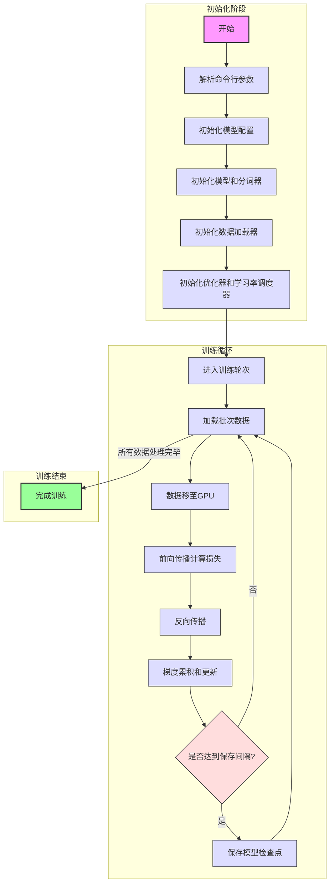

# 预训练代码工作流程图

## 关键步骤说明

1. **初始化阶段**
   - 解析命令行参数：设置训练参数如批次大小、学习率等
   - 初始化模型配置：设置模型维度、层数等超参数
   - 初始化模型和分词器：创建模型实例和加载分词器
   - 初始化数据加载器：准备训练数据

2. **训练循环**
   - 加载批次数据：从数据集中获取训练样本
   - 数据处理：将数据移至GPU并进行必要的预处理
   - 模型训练：进行前向传播和反向传播
   - 参数更新：根据累积的梯度更新模型参数
   - 模型保存：定期保存训练检查点

3. **训练结束**
   - 完成所有训练轮次后结束训练

## 特殊说明

- 使用梯度累积技术来支持更大的批次大小
- 支持分布式训练加速
- 使用混合精度训练提高效率
- 动态调整学习率优化训练过程