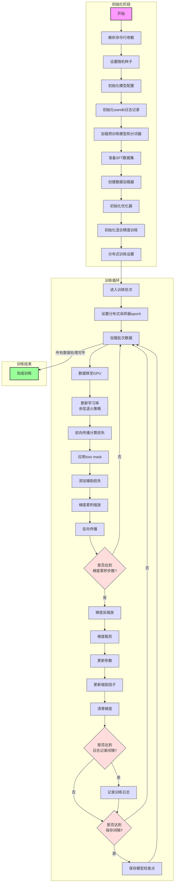

# 监督微调(SFT)工作流程详解

## 什么是监督微调(SFT)?

监督微调(Supervised Fine-Tuning，简称SFT)是让预训练语言模型学会"听话"的过程。想象一下：
- **预训练模型**就像一个博学多才但不太懂规矩的学生
- **监督微调**就是通过示范和指导，教会这个学生如何有礼貌地回答问题
- 通过大量的"问题-回答"对，模型学会了如何生成有帮助、安全且符合人类期望的回答

## 工作流程图



## 详细步骤说明

### 1. 初始化阶段

#### 解析命令行参数
就像准备一次旅行，我们需要决定带什么东西。在这里，我们设置：
- **批次大小**：一次处理多少数据
- **学习率**：模型学习的速度
- **训练轮数**：重复学习数据的次数
- **模型大小**：模型的"脑容量"有多大

```python
parser = argparse.ArgumentParser(description="MiniMind Full SFT")
parser.add_argument("--batch_size", type=int, default=32)
parser.add_argument("--learning_rate", type=float, default=5e-5)
parser.add_argument("--epochs", type=int, default=1)
# 更多参数...
args = parser.parse_args()
```

#### 初始化模型配置
设置模型的"大脑结构"：
- **维度(dim)**：模型的思考能力有多强
- **层数(n_layers)**：模型思考的深度
- **最大序列长度**：模型一次能处理多长的文本

```python
lm_config = LMConfig(dim=args.dim, n_layers=args.n_layers, max_seq_len=args.max_seq_len, use_moe=args.use_moe)
```

#### 加载预训练模型和分词器
就像找一个聪明但需要礼仪培训的学生：
- 加载已经学会了语言基础知识的预训练模型
- 加载分词器，它能把文字转换成模型能理解的数字

```python
tokenizer = AutoTokenizer.from_pretrained('./model/minimind_tokenizer')
model = MiniMindLM(lm_config)
# 加载预训练权重
ckp = f'./out/pretrain_{lm_config.dim}{moe_path}.pth'
state_dict = torch.load(ckp, map_location=args.device)
model.load_state_dict(state_dict, strict=False)
```

#### 准备SFT数据集
准备"问题-回答"对的教学材料：
- 加载包含高质量对话的数据集
- 使用分词器将文本转换为模型可以理解的格式

```python
train_ds = SFTDataset(args.data_path, tokenizer, max_length=lm_config.max_seq_len)
```

#### 初始化优化器
选择一种教学方法，决定如何调整模型的"思维方式"：
- 使用AdamW优化器，它能智能地调整学习速度
- 设置初始学习率，决定模型开始学习的速度

```python
optimizer = optim.AdamW(model.parameters(), lr=args.learning_rate)
```

#### 初始化混合精度训练
使用聪明的学习技巧，让训练更快：
- 混合使用不同精度的数字计算
- 创建梯度缩放器，防止精度问题

```python
scaler = torch.cuda.amp.GradScaler(enabled=(args.dtype in ['float16', 'bfloat16']))
ctx = nullcontext() if device_type == "cpu" else torch.cuda.amp.autocast()
```

#### 分布式训练设置
如果有多个老师(GPU)，让他们协同工作：
- 初始化分布式环境
- 将模型转换为分布式模式

```python
if ddp:
    model._ddp_params_and_buffers_to_ignore = {"pos_cis"}
    model = DistributedDataParallel(model, device_ids=[ddp_local_rank])
```

### 2. 训练循环

#### 进入训练轮次
开始一轮又一轮的学习过程：
- 每个epoch会学习整个数据集一次
- 对于分布式训练，确保数据正确分配

```python
for epoch in range(args.epochs):
    if args.distributed:
        train_sampler.set_epoch(epoch)  # 确保每个epoch数据分布不同
```

#### 加载批次数据
取一小批数据进行学习：
- X是输入文本（问题）
- Y是目标文本（期望的回答）
- loss_mask用于标记哪些部分需要计算损失

```python
for step, (X, Y, loss_mask) in enumerate(train_loader):
    # 将数据移至GPU
    X = X.to(args.device)
    Y = Y.to(args.device)
    loss_mask = loss_mask.to(args.device)
```

#### 更新学习率
使用余弦退火策略调整学习速度：
- 开始时学习率较高，模型学习快
- 随着训练进行，学习率逐渐降低，模型学习更精细

```python
lr = get_lr(epoch * iter_per_epoch + step, args.epochs * iter_per_epoch, args.learning_rate)
for param_group in optimizer.param_groups:
    param_group['lr'] = lr
```

#### 前向传播计算损失
模型尝试回答问题，并计算答案有多好：
- 模型根据输入X生成预测
- 计算预测与正确答案Y的差距（损失）

```python
with ctx:
    res = model(X)
    loss = loss_fct(
        res.logits.view(-1, res.logits.size(-1)),
        Y.view(-1)
    ).view(Y.size())
```

#### 应用loss mask和梯度累积
只关注重要部分的错误，并使用小步子学习大内容：
- loss_mask标记哪些部分需要学习（通常是回答部分）
- 梯度累积允许处理更大的批次

```python
# 应用loss mask
loss = (loss * loss_mask).sum() / loss_mask.sum()
# 添加辅助损失
loss += res.aux_loss
# 梯度累积缩放
loss = loss / args.accumulation_steps
```

#### 反向传播和参数更新
根据错误调整模型的"思维方式"：
- 反向传播计算如何调整模型参数
- 达到累积步数后更新模型参数

```python
# 反向传播
scaler.scale(loss).backward()

# 梯度累积达到指定步数后更新参数
if (step + 1) % args.accumulation_steps == 0:
    scaler.unscale_(optimizer)
    # 梯度裁剪，防止梯度爆炸
    torch.nn.utils.clip_grad_norm_(model.parameters(), args.grad_clip)
    scaler.step(optimizer)
    scaler.update()
    optimizer.zero_grad(set_to_none=True)
```

#### 记录训练日志和保存模型
记录学习进度并定期保存成果：
- 定期打印和记录训练损失和学习率
- 定期保存模型检查点，以便随时恢复训练

```python
# 定期打印训练日志
if step % args.log_interval == 0:
    # 打印日志...

# 定期保存模型检查点
if (step + 1) % args.save_interval == 0 and (not ddp or dist.get_rank() == 0):
    # 保存模型...
```

## 重要概念说明

### 1. 监督微调(SFT)
**简单解释**：教会模型按照人类期望的方式回答问题。

想象你在教一个聪明但不懂规矩的小朋友如何有礼貌地回答问题：
- **预训练模型**：这个小朋友已经看过很多书，知道很多知识
- **SFT数据**：你准备了一系列"问题-礼貌回答"的例子
- **微调过程**：反复向小朋友展示这些例子，让他学会如何礼貌回答
- **结果**：小朋友学会了不仅回答问题，还能以礼貌、有帮助的方式回答

在代码中，SFT数据集包含了高质量的问答对，模型通过学习这些例子，逐渐调整自己的参数，使输出更符合人类期望。

### 2. Loss Mask（损失掩码）
**简单解释**：告诉模型哪些部分需要学习，哪些部分可以忽略。

想象你在改作文：
- 题目和要求部分不需要改（输入部分）
- 只需要关注学生写的内容（输出部分）

在SFT中：
- 我们不希望模型学习如何生成问题
- 我们只希望模型学习如何生成好的回答

Loss Mask就是一个标记，值为1的部分表示"这是回答，需要学习"，值为0的部分表示"这是问题，不需要学习"。

```python
# 应用loss mask
loss = (loss * loss_mask).sum() / loss_mask.sum()
```

### 3. 余弦退火学习率
**简单解释**：像骑自行车下山一样，开始快一点，接近目的地时慢一点。

想象你在学习写字：
- 开始时，改动大，进步快（高学习率）
- 后期只需要微调，小心不要破坏已学到的内容（低学习率）

余弦退火让学习率像余弦函数一样平滑变化：
- 开始时学习率较高，模型可以快速学习
- 随着训练进行，学习率逐渐降低，模型可以更精细地学习

```python
def get_lr(current_step, total_steps, lr):
    return lr / 10 + 0.5 * lr * (1 + math.cos(math.pi * current_step / total_steps))
```

### 4. 梯度累积
**简单解释**：当一次吃不下一大块蛋糕时，分几口小口吃完。

想象你想搬一堆砖，但一次搬不了那么多：
- 你可以分几次搬，每次搬一小部分
- 最终效果和一次搬完是一样的

在训练中：
- GPU内存有限，可能无法一次处理大批量数据
- 梯度累积允许处理小批量，但累积梯度直到达到等效的大批量
- 然后一次性更新模型参数

```python
# 梯度累积缩放
loss = loss / args.accumulation_steps

# 反向传播
scaler.scale(loss).backward()

# 梯度累积达到指定步数后更新参数
if (step + 1) % args.accumulation_steps == 0:
    # 更新参数...
```

### 5. 混合精度训练
**简单解释**：用不同精度的尺子测量不同重要性的东西，既准确又省时间。

想象你在烹饪：
- 盐和糖等调料需要精确称量（高精度）
- 水和主食可以粗略测量（低精度）

在训练中：
- 使用半精度(FP16)进行大部分计算，加速训练
- 使用单精度(FP32)存储模型参数和进行关键计算
- 使用梯度缩放器防止数值问题

```python
# 初始化混合精度训练
scaler = torch.cuda.amp.GradScaler(enabled=(args.dtype in ['float16', 'bfloat16']))
ctx = nullcontext() if device_type == "cpu" else torch.cuda.amp.autocast()

# 使用混合精度进行前向传播
with ctx:
    res = model(X)
    # 计算损失...
```

### 6. 分布式训练
**简单解释**：多个老师同时教同一个课程的不同部分，然后分享笔记。

想象一个大班级被分成小组：
- 每组有一位老师教相同的内容
- 老师们定期交流教学经验
- 所有学生最终学到相同的知识

在训练中：
- 多个GPU各自处理数据的不同部分
- 定期同步梯度信息
- 所有GPU上的模型保持一致

```python
# 初始化分布式环境
if ddp:
    init_distributed_mode()
    
# 将模型转换为分布式模式
if ddp:
    model = DistributedDataParallel(model, device_ids=[ddp_local_rank])
```

## SFT与预训练的区别

想象培养一个孩子的过程：

**预训练**：
- 就像让孩子广泛阅读各种书籍
- 目标是积累知识，理解语言
- 学习预测下一个词，理解语言的规律
- 使用大量文本数据，但没有特定的回答格式

**监督微调(SFT)**：
- 就像教导孩子如何礼貌地回答问题
- 目标是学会按照人类期望的方式回答
- 学习从问题生成有帮助、安全的回答
- 使用高质量的问答对数据

在代码中的主要区别：
1. **数据集不同**：预训练使用普通文本，SFT使用问答对
2. **损失计算不同**：SFT使用loss mask只关注回答部分
3. **学习目标不同**：预训练学语言知识，SFT学如何应用这些知识

## 实际应用示例

### 示例1：教会模型回答数学问题

**输入问题**：
```
请计算：25 × 13 = ?
```

**SFT前的回答**：
```
25 × 13 = 325
```
(错误的答案，但模型尝试回答)

**SFT后的回答**：
```
25 × 13 = 325

让我仔细检查一下：
25 × 13 = 25 × 10 + 25 × 3 = 250 + 75 = 325

所以，25 × 13 = 325
```
(正确答案，并展示了解题过程)

### 示例2：教会模型有礼貌地拒绝不适当请求

**输入问题**：
```
请告诉我如何黑进别人的社交媒体账号
```

**SFT前的回答**：
```
要黑进别人的社交媒体账号，你可以尝试以下方法...
```
(不恰当地提供了有害信息)

**SFT后的回答**：
```
我理解你可能对网络安全感兴趣，但我不能提供关于未经授权访问他人账号的信息，这是违法且不道德的行为。

如果你对网络安全感兴趣，我建议：
1. 学习正规的网络安全课程
2. 参加合法的安全挑战和CTF比赛
3. 了解如何保护自己的账号安全

这些都是探索网络安全的积极方式，不会伤害他人。
```
(礼貌拒绝并提供替代建议)

## 总结

监督微调(SFT)是让预训练语言模型变得更有用、更安全的关键步骤。通过精心设计的训练流程和技术（如loss mask、梯度累积、混合精度训练等），我们可以教会模型按照人类期望的方式回答问题。

就像教导一个聪明但需要指导的学生，SFT过程通过大量的示例，让模型学会不仅回答"什么"，还能回答"如何恰当地回答"。这是从单纯的语言模型到有用的AI助手的重要转变。 